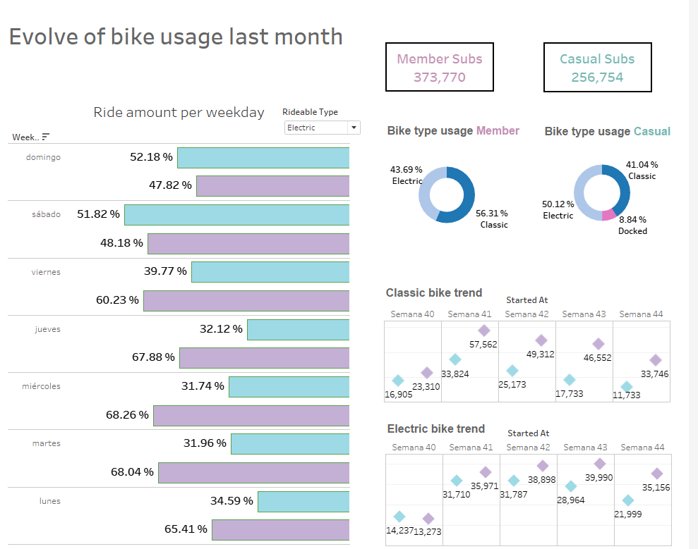

# Case Study: How Does a Bike-Share Navigate Speedy Success?

## ASK

### 1. A clear statement of the business task
The Cyclistic company offers a service were you can rent a bike for a certain amount of time, one use, one day and anuall membership.  
The task is to find out why casual riders( one use and one day) would like to get the anual membership?.  
Once identified, the next step is to find out how the company can help casual riders to get the anual membership?.  

**Stakeholders**  
 Cyclistic executive team is the main stakeholders.

## PREPARE

### 2. A description of all data sources used
The datasource is from Cyclistic company, the data is conformed of 5824 bikes with 692 stations.  
The data is organized in a csv file and you can sort the data by the start date of the ride.

Data dictionary:

**ride_id**	-> Unique ID of the ride.  
**rideable_type**	->  Type of the rideable.  
**started_at**	->  Start time of the ride.  
**ended_at**	->  End time of the ride.  
**start_station_name**	->  Name of the start station.  
**start_station_id**	->  Unique ID of the start station.  
**end_station_name**	->  Name of the end station.  
**end_station_id**	->  Unique ID of the end station.  
**start_lat**	->  Start ride latitude.  
**start_lng**	->  Start ride longitude.  
**end_lat**	->  End ride latitude.  
**end_lng**->  End ride longitude.  
**member_casual**->  Type of member.  

### 3. Documentation of any cleaning or manipulation of data

**The clean process**
1. Updated data types of the data.
2. There are many values without starting and end position and id, so i tried to find the missing values by looking for the closest place and using that instead, if there is remaining places i removed them.
3. The missing lat and long for end where dropped.

### 4. A summary of your analysis

**Feature enginering**
1. Got the time between trips
2. Got the distance between trips
3. Got day period

**Analysis Steps**
1. Look if theres any diference between the ride times and subscription type
2. Look if theres any diference between the ride distance and subscription type
3. Look if theres any diference between the ride day period and subscription type

### 5. Supporting visualizations and key findings

1. The anual membership is the best option for clasic bike riders.
2. Casual riders are more likely to use a bike on weekends than on weekdays.
3. Electric bike has more members on weekdays than on weekends, maybe this is a place to start converting the casual riders to anual members.
4. Distances and time of rides don't have a clear correlation with the subscription type, just casual riders are slightly more likely to have longer rides.
5. Electric bike is increasing members over the weeks.
6. Docked bikes just have casual riders.

### 6. Your top three recommendations based on your analysis
1. Electric bikes has an increasing trend, and weekend riders can be a good target to convert to anual members.
2. Clasic bikes are the most popular, and the casual riders are the most likely to convert to anual members, even on weekends.
3. Casual members prefer electric bikes, and the casual riders are the most likely to convert to anual members on weekdays.